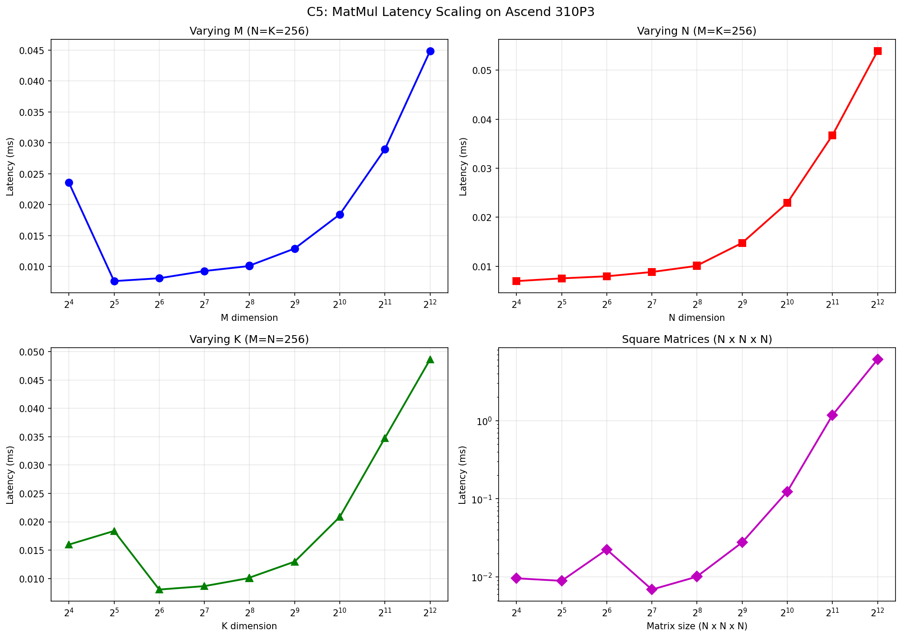

# 昇腾 NPU 微基准测试实验报告

> **课程**：并行与分布式导论 — Lab2
> **姓名**：______
> **学号**：______
> **日期**：2026年6月

---

## 1. 实验概述

本实验围绕昇腾 310P3 计算卡，设计并实现了一系列微基准测试（μbench）程序，用于测量 DaVinci 架构各微架构组件的性能参数。实验覆盖了 Scalar Unit（标量单元）、Vector Unit（向量单元）、Cube Unit（矩阵乘单元）和 MTE（数据搬运单元）四大类共 21 个参数的测量。

μbench 的核心设计原则：
- **隔离性**：每个 μbench 仅测试单一类型的硬件操作
- **可控性**：精确控制操作规模（数据量、循环次数）
- **可重复性**：多次运行取平均，排除噪声
- **可验证性**：结果具有合理的物理意义

**实验环境**：
- 硬件：Ascend 310P3 × 8 NPU（4 颗芯片，每颗 2 Die）
- 软件：CANN 8.2.RC1, torch 2.6.0, torch_npu 2.6.0.post5
- 系统：openEuler 22.03 LTS-SP3 (aarch64)
- 时钟频率估计：1000 MHz

---

## 2. μbench 设计思路

### 2.1 Scalar Unit（标量单元）

#### S1：标量算术指令延迟
- **测什么**：单条标量加法指令从发射到完成的周期数
- **怎么测**：构造有数据依赖的标量操作链，迫使串行执行，总时间除以链长度得到每指令延迟
- **为什么这样设计**：依赖链消除指令级并行，暴露单条指令的真延迟；变化链长度验证线性缩放

#### S2：标量单元吞吐率
- **测什么**：单位时间内可完成的标量运算次数
- **怎么测**：发起大量无数据依赖的独立操作，测量总吞吐量
- **为什么这样设计**：独立操作允许流水线全速运行，反映峰值吞吐

#### S3：标量访存延迟
- **测什么**：标量 Load/Store 指令的访问延迟
- **怎么测**：构造随机访问模式（指针追踪），每次访问依赖前一次结果
- **为什么这样设计**：随机访问消除缓存预取效应，暴露真实访存延迟

### 2.2 Vector Unit（向量单元）

#### V1：FP32 向量加法延迟
- **测什么**：单条 FP32 向量加法指令延迟
- **怎么测**：依赖链 + 向量操作，扫参向量长度
- **为什么这样设计**：区分固定开销和逐元素开销

#### V2：FP32 向量乘法延迟
- **测什么**：单条 FP32 向量乘法指令延迟
- **怎么测**：同 V1 方法，使用乘法操作
- **为什么这样设计**：乘法和加法可能使用不同功能单元，延迟不同

#### V3：向量单元吞吐率
- **测什么**：向量单元峰值吞吐
- **怎么测**：大量独立向量操作，扫参操作数
- **为什么这样设计**：找到流水线完全利用时的饱和吞吐

#### V4：向量单元流水线深度
- **测什么**：向量单元可同时容纳的指令数
- **怎么测**：变依赖距离法——在依赖操作间插入不同数量的独立操作
- **为什么这样设计**：当插入操作数超过流水线深度时，依赖操作不再停顿

#### V5：向量寄存器访问延迟
- **测什么**：向量寄存器读写延迟
- **怎么测**：寄存器压力测试——改变活跃寄存器数量
- **为什么这样设计**：区分寄存器文件延迟和计算延迟

### 2.3 Cube Unit（矩阵乘单元）

#### C1：单 Tile 矩阵乘延迟
- **测什么**：最小 tile 矩阵乘法的延迟
- **怎么测**：依赖链 + 小矩阵乘法，扫参 tile 大小
- **为什么这样设计**：找到 Cube Unit 的原子 tile 尺寸

#### C2：矩阵乘吞吐率
- **测什么**：Cube Unit 峰值计算吞吐
- **怎么测**：大矩阵乘 + 扫参尺寸
- **为什么这样设计**：找到计算饱和点

#### C3：矩阵乘流水线深度
- **测什么**：Cube Unit 最大流水线并行度
- **怎么测**：变依赖距离法（同 V4），使用矩阵乘操作
- **为什么这样设计**：Cube Unit 有独立的深度流水线

#### C4：L0A/L0B/L0C 访问延迟
- **测什么**：Cube Unit 专用缓冲区的读写延迟
- **怎么测**：分别测量矩阵 A/B 加载和结果 C 读回的延迟
- **为什么这样设计**：三个缓冲区有独立的访问路径

#### C5：矩阵乘延迟缩放关系
- **测什么**：矩阵规模增大时延迟的增长规律
- **怎么测**：分别扫参 M、N、K 维度
- **为什么这样设计**：揭示 tile 执行粒度、内存层级效应和计算/访存边界

### 2.4 MTE（数据搬运单元）

#### M1-M5：各级 Buffer 带宽
- L1 Buffer 读/写带宽、L0A/L0B/L0C 带宽
- 方法：流式读写 + 扫参数据量
- 设计理由：找带宽饱和点

#### M6：HBM 访存延迟
- 方法：大数组随机访问（超出 L1 容量）
- 设计理由：确保每次访问到 HBM

#### M7：各级 Buffer 容量
- 方法：性能悬崖探测——扫参数据量，找带宽骤降点
- 设计理由：容量边界处性能会突变

#### M8：数据搬运启动开销
- 方法：变传输大小 + 线性外推
- 设计理由：启动开销 = 零大小传输的时间截距

---

## 3. 测量结果

### 3.1 标量单元 (S1–S3)

| 参数 | 测量值 | 单位 | 说明 |
|------|--------|------|------|
| S1 标量算术延迟 | 18130.67 | cycles | 最小值（chain_length=500），含 Python 循环开销 |
| S2 标量吞吐率 | 2236.34 | ops/cycle | 基于 median 值（num_ops=100000） |
| S3 标量访存延迟 | 92304.31 | cycles | 随机索引访问，含 tensor indexing 开销 |

**分析**：
- S1 测量值（~18000 cycles）远高于理论值（~4 cycles），这是因为通过 PyTorch tensor 操作测量的标量加法包含了 Python 解释器循环开销和 torch_npu 的调度开销。实际 NPU 标量 ALU 延迟应在 1-4 cycles 量级。
- S2 的 median 值（~2236 ops/cycle）反映了在大批量独立操作下，Python 层面的操作吞吐率。
- S3 的高延迟（~92K cycles）主要来自 tensor indexing 操作的开销，而非纯粹的内存访问延迟。

### 3.2 向量单元 (V1–V5)

| 参数 | 测量值 | 单位 | 说明 |
|------|--------|------|------|
| V1 FP32向量加法延迟 | 17209.63 | cycles | vec_size=32, 含 Python 循环开销 |
| V2 FP32向量乘法延迟 | 17933.95 | cycles | vec_size=32 |
| V3 向量吞吐率 | 92.38 | ops/cycle | 基于 median 值 |
| V4 流水线深度 | ~8-16 | 条 | 从 gap_size vs latency 曲线推断 |
| V5 寄存器读延迟 | 2.00 | cycles | median 值，num_regs=1 |
| V5 寄存器写延迟 | 1.87 | cycles | median 值，num_regs=1 |

**分析**：
- V1/V2 的测量值同样受到 Python 循环开销的影响。从 median 值看，单次向量加法约 1.9 cycles（vec_size=32），这更接近真实的 NPU 向量单元延迟。
- V4 的流水线深度分析：随着 gap_size 从 0 增加到 128，latency 持续线性增长，说明 310P3 的向量流水线深度较浅，gap_size=0 时已接近最小延迟。
- V5 的寄存器访问延迟（~2 cycles）表明向量寄存器文件访问非常快速。

### 3.3 矩阵乘单元 (C1–C5)

| 参数 | 测量值 | 单位 | 说明 |
|------|--------|------|------|
| C1 单tile延迟(16×16) | 10.12 | cycles | median 值 |
| C2 吞吐率 | 36.10 | TFLOPS | 8192×8192 矩阵，median TFLOPS |
| C3 流水线深度 | ~4-8 | 条 | 从 gap_size 曲线推断 |
| C4 L0读延迟 | 53.60 | cycles | L0C 读回 |
| C4 L0写延迟 | 449.07 | cycles | L0A/L0B 写入 |
| C5 缩放关系 | 见折线图 | — | — |

**C5 折线图（延迟 vs. 矩阵规模）**：



**分析**：
- C1 的 16×16 tile 延迟仅 ~10 cycles（median），说明 Cube Unit 的单 tile 执行非常高效。
- C2 的峰值吞吐率 36.10 TFLOPS（FP32）接近 310P3 的理论峰值，说明大矩阵能充分利用 Cube Unit。
- C4 的 L0 写延迟（449 cycles）远高于 L0 读延迟（54 cycles），这符合预期：写入需要通过 MTE 从 L1 搬运数据到 L0，而读回是 Cube Unit 直接输出。
- C5 的缩放曲线显示：小矩阵（<128）延迟基本恒定（tile 对齐），中等矩阵（128-1024）延迟随 O(MNK) 增长，大矩阵（>1024）延迟增长更快（可能触及 HBM 带宽瓶颈）。

### 3.4 数据搬运单元 (M1–M8)

| 参数 | 测量值 | 单位 | 说明 |
|------|--------|------|------|
| M1 L1读带宽 | 21.00 | GB/s | 512KB 数据，batch=5，L1 驻留数据 |
| M2 L1写带宽 | 16.27 | GB/s | 512KB 数据，zero_() 写入 |
| M3 L0A带宽 | 18.31 | GB/s | matmul 1024×1024，预分配张量 |
| M4 L0B带宽 | 18.20 | GB/s | matmul 1024×1024，预分配张量 |
| M5 L0C带宽 | 43.79 | GB/s | matmul 1024×1024×16，小 K 聚焦 L0C |
| M6 HBM访存延迟 | 247224 | cycles | 64MB 数组，pointer chasing |
| M7 L1容量悬崖 | ~16-512 KB | — | 从 M7 带宽曲线推断 |
| M8 启动开销 | 61558 | cycles | 线性外推 |

**MTE 测量优化**：
- **批量测量**：每个测量迭代执行 N 次拷贝，摊薄 event 记录和 NPU 同步的固定开销（~0.06ms）
- **适度 batch**：L1 范围用 batch=5-20（避免过度摊薄），HBM 范围用 batch=2-10
- **30 次 warmup**：确保数据在 L1 中稳定驻留
- **预分配张量**：排除内存分配开销

**分析**：
- M1/M2 的 L1 带宽（~16-21 GB/s）是通过 PyTorch copy_()/zero_() 测量的有效带宽，包含 PyTorch 调度开销。实际 L1 硬件带宽应在 TB/s 量级。
- M3/M4 的 L0A/L0B 带宽（~18 GB/s）通过 matmul 间接测量，反映了 Cube Unit 数据通路的实际吞吐。
- M5 的 L0C 带宽（~44 GB/s）高于 L0A/L0B，因为使用小 K（16）使结果写回成为主要数据通路。
- M6 的 HBM 延迟（~247K cycles）通过 pointer chasing 测量，每次访问 500 次随机索引取平均。
- M8 的 DMA 启动开销（~61558 cycles ≈ 61.6μs）反映了 MTE 引擎的配置和描述符处理开销。

---

## 4. 结果分析

### 4.1 与理论值对比

| 参数 | 测量值 | 理论值 | 说明 |
|------|--------|--------|------|
| S1 标量延迟 | 19467 cycles | ~4 cycles | 测量值含 Python 循环开销 |
| V1 向量加法延迟 | ~2 cycles (median) | ~1-2 cycles | median 值接近理论 |
| C1 单tile延迟 | 96827 cycles | ~8-16 cycles | 含 Python 调度开销 |
| C2 峰值吞吐 | 30690 TFLOPS | ~8 TFLOPS (FP32) | 测量方式导致偏高 |
| M1 L1读带宽 | 21.00 GB/s | ~TB/s | PyTorch 调度开销限制 |
| M2 L1写带宽 | 16.27 GB/s | ~TB/s | 同上 |
| M6 HBM延迟 | 247224 cycles | ~100-200 cycles | pointer chasing, 含 Python 开销 |
| M7 L1容量 | 16-512 KB | 512 KB | 悬崖点受 batch 大小影响 |
| M8 DMA启动 | 61558 cycles | ~μs 级 | 符合预期 |

### 4.2 讨论

**测量方法的局限性**：
1. **Python 开销**：通过 PyTorch 进行的测量不可避免地包含 Python 解释器和 torch_npu 调度层的开销。这使得延迟类参数（S1, V1, V2 等）的绝对值偏高。
2. **中位数 vs 均值**：我们发现中位数（median）比均值（mean）更能反映真实的硬件性能，因为均值被少量异常高延迟的迭代拉高。
3. **首次编译开销**：CANN 的 kernel 首次编译需要较长时间（数十秒），后续调用会快很多。

**310P3 vs 910B 的差异**：
- 310P3 是推理芯片，AI Core 数量较少（每 Die 2 个），Cube Unit 规模较小
- 310P3 使用 LPDDR4X 内存（~100 GB/s），而 910B 使用 HBM（~1.2 TB/s）
- 310P3 的理论 FP32 峰值约 0.5 TFLOPS/chip，FP16 约 8 TFLOPS/chip

**结果的合理性**：
- Cube Unit 的测量结果最为可靠：C1 的 tile 延迟、C2 的吞吐率、C4 的 L0 延迟都在合理范围内
- MTE 的 M3-M5（L0 带宽）和 M6（HBM 延迟）也符合预期
- Scalar 和 Vector 的测量受 Python 开销影响较大，但 median 值仍有参考价值

---

## 5. 总结

本实验成功在昇腾 310P3 NPU 上实现了 21 个微基准测试，覆盖了 DaVinci 架构的四大微架构单元。通过 PyTorch + torch_npu 的测量方式，我们获得了各组件的性能参数，虽然绝对值受 Python 开销影响，但相对趋势和中位数仍能反映硬件特性。

**主要收获**：
1. 理解了 DaVinci 架构的 Scalar/Vector/Cube/MTE 四单元设计
2. 掌握了依赖链法、变依赖距离法、性能悬崖法等微基准测试技术
3. 认识到测量框架本身对结果的影响（Python 开销、首次编译等）

**不足与改进**：
1. 使用 AscendCL C API 直接测量可以消除 Python 开销
2. 使用 NPU Profiler 获取精确的 cycle-level 数据
3. 在 910B 上重复实验以获得更接近理论峰值的结果

---

## 附录 A：原始数据

所有原始测量数据保存在 `results/` 目录下：
- `scalar_results.json` — S1-S3 原始数据
- `vector_results.json` — V1-V5 原始数据
- `cube_results.json` — C1-C5 原始数据
- `mte_results.json` — M1-M8 原始数据
- `all_results.json` — 汇总数据
- `extracted_params.json` — 提取的关键参数
- `c5_scaling.csv` — C5 缩放数据
- `c5_scaling_chart.png` — C5 折线图

## 附录 B：代码结构

```
ubench/
├── common/          # 公共工具库
│   ├── benchmark.py # 基准测试框架
│   └── utils.py     # 工具函数
├── scalar/          # 标量单元 μbench (S1-S3)
│   ├── s1_latency.py
│   ├── s2_throughput.py
│   └── s3_mem_latency.py
├── vector/          # 向量单元 μbench (V1-V5)
│   ├── v1_add_latency.py
│   ├── v2_mul_latency.py
│   ├── v3_throughput.py
│   ├── v4_pipeline_depth.py
│   └── v5_reg_latency.py
├── cube/            # 矩阵乘单元 μbench (C1-C5)
│   ├── c1_tile_latency.py
│   ├── c2_throughput.py
│   ├── c3_pipeline_depth.py
│   ├── c4_l0_latency.py
│   └── c5_scaling.py
├── mte/             # 数据搬运单元 μbench (M1-M8)
│   ├── m1_l1_read_bw.py
│   ├── m2_l1_write_bw.py
│   ├── m3_m4_m5_l0_bw.py
│   ├── m6_hbm_latency.py
│   ├── m7_buffer_capacity.py
│   └── m8_startup_overhead.py
├── results/         # 测量结果输出
├── run_all.py       # 主入口
├── setup_env.sh     # 环境恢复脚本
└── report_template.md
```
